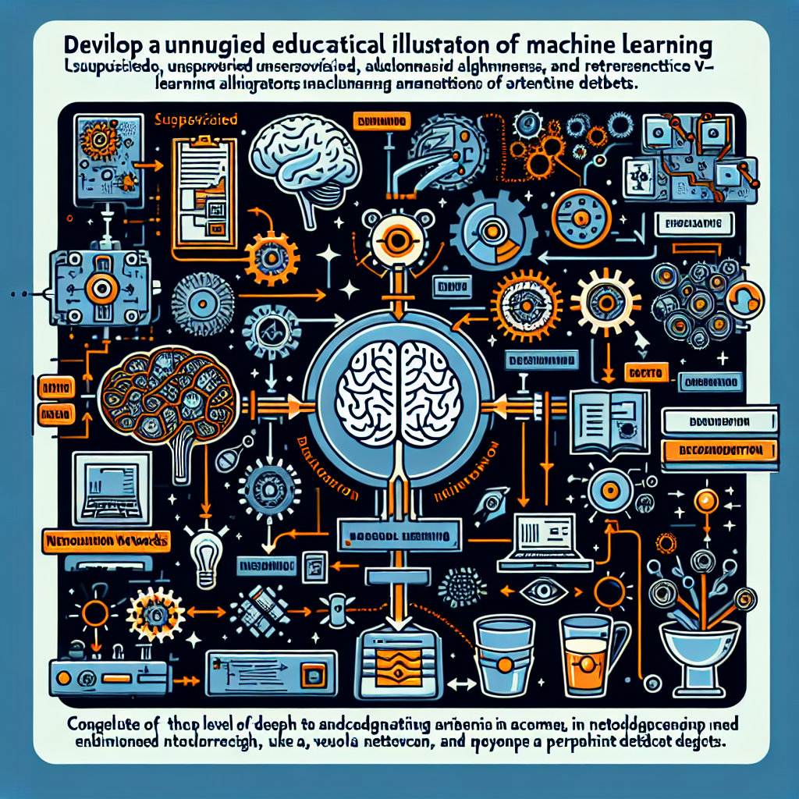
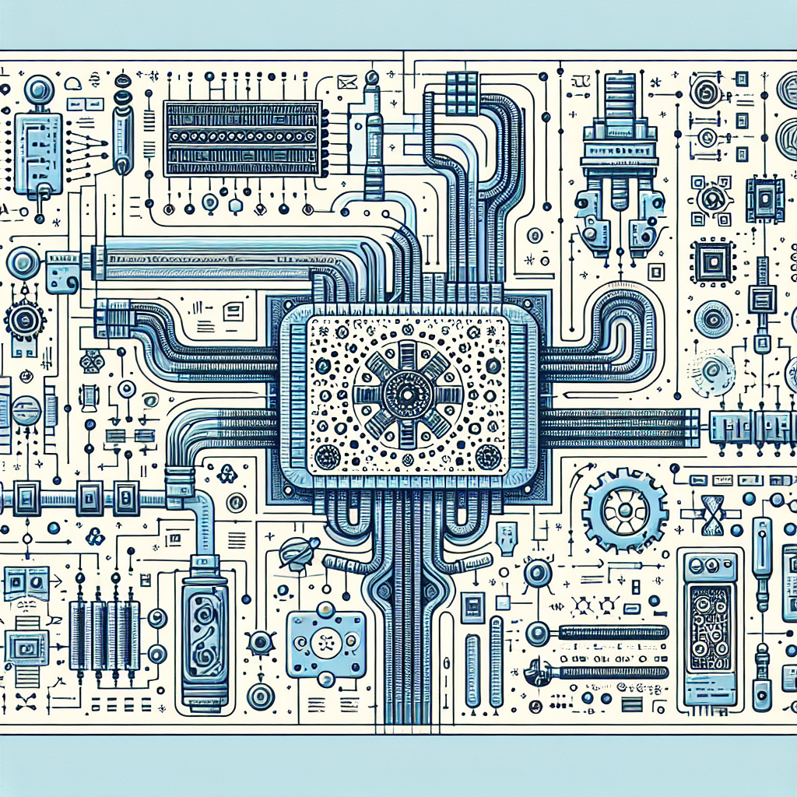
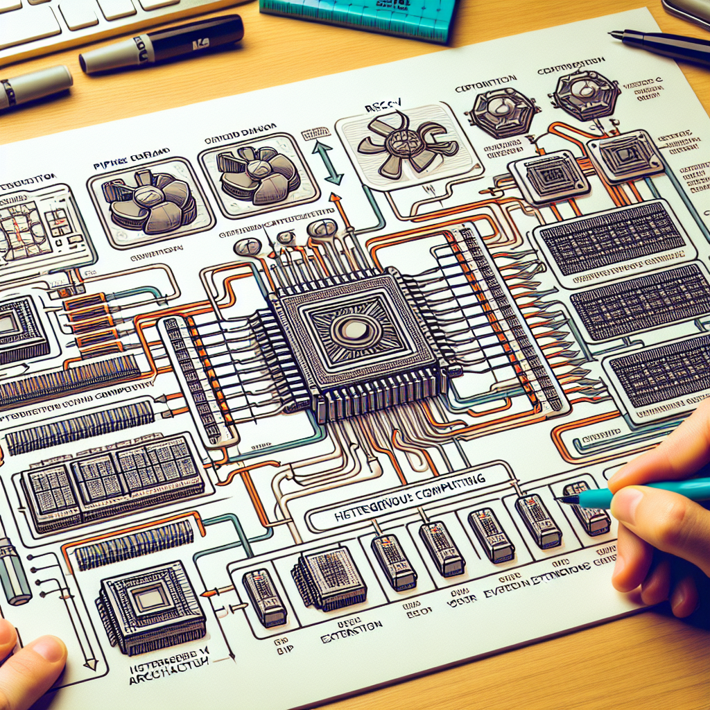
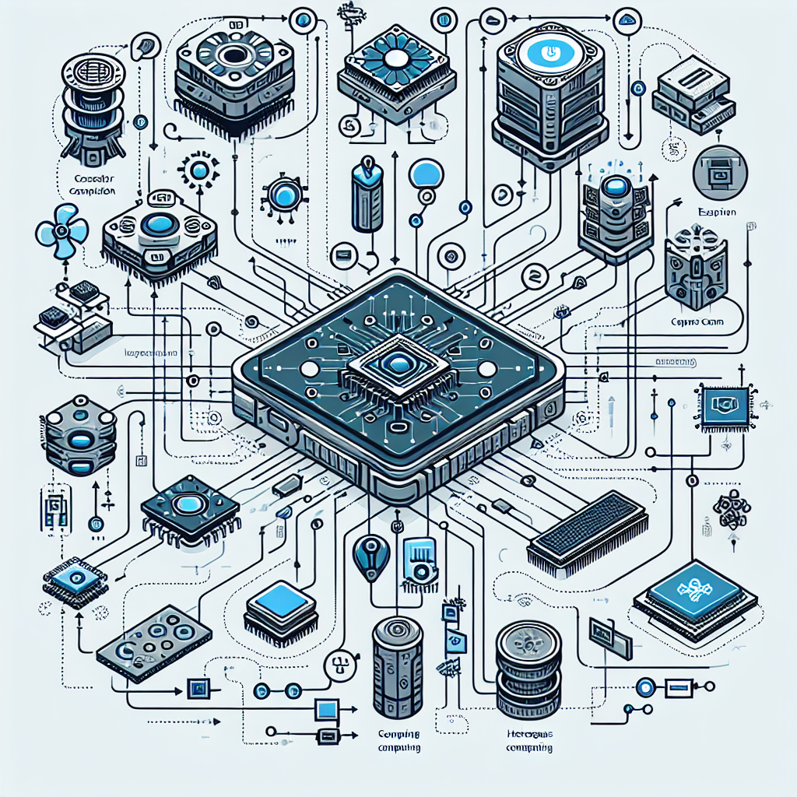
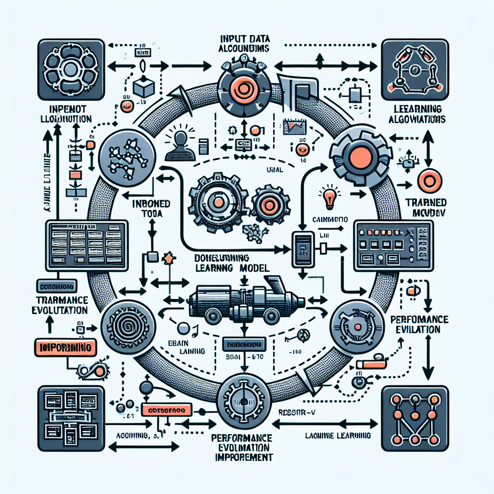
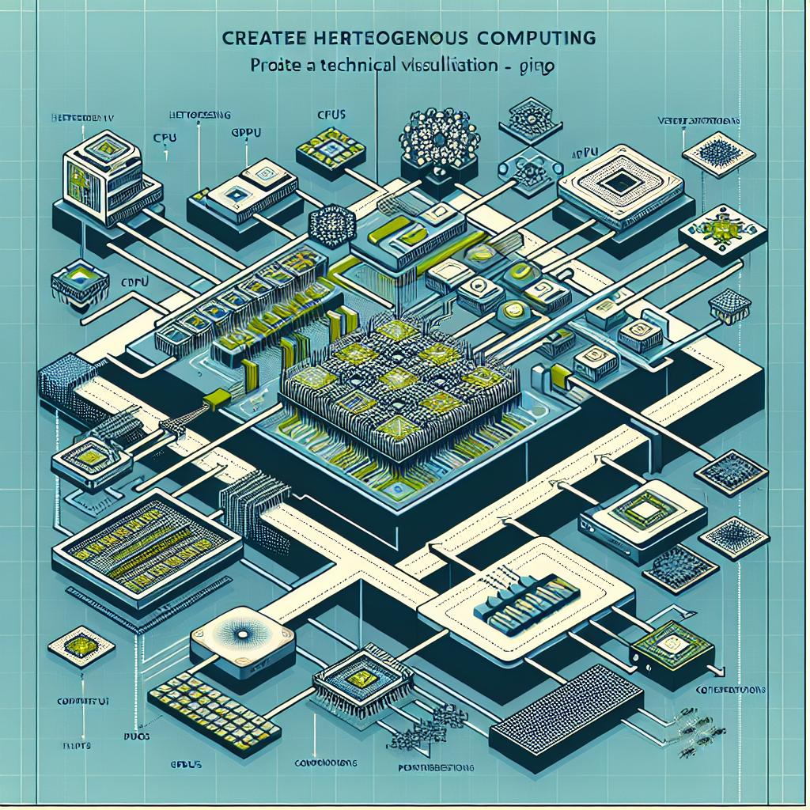

## Version 1
The continuous quest for enhancing processor performance has led to the exploration of novel architectural concepts, pushing the boundaries of traditional design paradigms. One such evolution that has revolutionized processor technology is the concept of parallelism. 

Parallelism allows multiple tasks to be executed simultaneously, thereby significantly boosting computational efficiency. This approach has given rise to multi-core processors, where multiple processing units, known as cores, work in tandem to execute instructions in parallel. The ability to divide tasks across multiple cores not only accelerates processing speed but also enables better utilization of resources, leading to improved performance and responsiveness.

In addition to parallelism, another key aspect of modern processor design is scalability. Scalability refers to the ability of a system to adapt and expand its processing capabilities to accommodate varying workloads and demands. By incorporating features such as dynamic frequency scaling and adaptive voltage scaling, modern processors can adjust their performance levels to meet the requirements of different applications, thereby optimizing energy efficiency while maintaining optimal performance.

Furthermore, the emergence of specialized computing has marked a significant shift in processor design philosophy. Specialized processors, such as graphics processing units (GPUs) and tensor processing units (TPUs), are tailored to excel at specific tasks like graphics rendering, machine learning, and artificial intelligence. By offloading computationally intensive tasks to these specialized units, overall system performance and efficiency can be greatly enhanced.

As we delve deeper into the intricate world of processor technology, it becomes increasingly evident that the path to innovation is paved with challenges and opportunities. Developers and researchers continually strive to balance the complexities of design with the demands for efficiency and versatility, driving the relentless pursuit of cutting-edge solutions that redefine the boundaries of computing.

In the chapters ahead, we will unravel the intricacies of advanced processor implementations, exploring the intricate interplay between hardware and software, the impact of emerging technologies like quantum computing, and the promising prospects that lie on the horizon of processor evolution. Join us on this enlightening journey through the ever-evolving landscape of processor technology, where innovation knows no bounds.

## Version 2
From the foundation of parallelism to the intricacies of specialized computing, the evolution of processor technology has been a relentless pursuit of performance optimization and efficiency enhancement. As we navigate the intricate world of processors, a realm where innovation and challenges coexist harmoniously, it's evident that the landscape of computing is constantly evolving.

One of the latest frontiers in processor design is the integration of heterogeneous computing architectures. These architectures combine various types of processing units, each optimized for specific tasks, to create a versatile and efficient computing environment. By leveraging the strengths of different types of processors, such as central processing units (CPUs), graphics processing units (GPUs), and field-programmable gate arrays (FPGAs), heterogeneous computing architectures offer unparalleled flexibility and performance scalability.

Moreover, the rise of neuromorphic computing represents a paradigm shift in processor technology. Inspired by the human brain's neural networks, neuromorphic processors emulate complex cognitive processes, enabling tasks like pattern recognition, machine learning, and artificial intelligence to be performed with remarkable efficiency. By mimicking the brain's neural architecture, neuromorphic processors hold the promise of unlocking unprecedented levels of computational power and intelligence.

In the realm of quantum computing, a disruptive technology on the horizon, processors are poised to transcend the limitations of classical computing. Quantum processors harness the principles of quantum mechanics to perform computations at an exponential speed, revolutionizing fields such as cryptography, optimization, and material science. Although quantum computing is still in its nascent stages, the potential for groundbreaking advancements in processor technology is undeniable.

As we look to the future, the horizons of processor technology seem boundless, with emerging trends like edge computing, quantum supremacy, and autonomous systems reshaping the very fabric of computing. The journey through the evolution of processors is a testament to human ingenuity, perseverance, and the insatiable quest for technological advancement.

Join us as we embark on a voyage through the uncharted territories of processor technology, where innovation thrives, challenges are met head-on, and the possibilities are limitless. Together, let us unravel the mysteries of advanced processor implementations, delve into the depths of cutting-edge research, and envision a future where the boundaries of computing are continually redefined.

## Version 3
Continuing on from the previous content:

Amidst the ever-evolving landscape of processor technology, a key area of focus that has garnered significant attention is the realm of heterogeneous computing architectures. These architectures represent a paradigm shift in how processors are designed and utilized, offering a versatile and efficient computing environment that leverages the unique strengths of different types of processing units.

At the core of heterogeneous computing architectures lies the concept of task-specific optimization. By integrating various processing units, such as CPUs, GPUs, and FPGAs, each tailored for specific tasks, these architectures enable a fine-grained approach to task allocation, maximizing performance while minimizing energy consumption. This intricate orchestration of resources unlocks a new realm of possibilities for applications ranging from scientific simulations to real-time image processing.

The fusion of CPUs and GPUs, for instance, has revolutionized the field of parallel computing, allowing for complex tasks to be divided and conquered with unparalleled efficiency. The CPU's versatility in handling sequential tasks is complemented by the GPU's prowess in parallel processing, creating a symbiotic relationship that accelerates computations in domains like artificial intelligence, data analytics, and high-performance computing.

Moreover, the integration of FPGAs in heterogeneous architectures introduces a level of reconfigurability and adaptability that transcends traditional fixed-function processors. FPGAs excel in tasks that require high-throughput processing and low-latency responses, making them ideal for applications like real-time signal processing, encryption/decryption algorithms, and hardware acceleration in cloud computing infrastructures.

As we navigate the intricate landscape of heterogeneous computing architectures, we are met with a tapestry of possibilities where the boundaries of traditional processor design are blurred, and the horizon of performance scalability is expanded. The interplay of different processing units in a cohesive architecture not only enhances computational speed and efficiency but also lays the groundwork for future innovations in specialized computing domains.

Join us as we delve deeper into the nuances of heterogeneous computing architectures, exploring the intricacies of task optimization, resource allocation strategies, and the symbiotic relationship between diverse processing units. Together, let us unravel the complexities of these cutting-edge architectures and envision a future where the convergence of CPUs, GPUs, and FPGAs propels us into a realm of unparalleled computational prowess and efficiency.

## Version 4
The evolution of processor technology has taken a significant leap forward with the advent of heterogeneous computing architectures. These architectures represent a pivotal shift in how processors are conceived, designed, and deployed, offering a dynamic computing environment that harnesses the strengths of diverse processing units to achieve unparalleled performance and efficiency.

At the heart of heterogeneous computing architectures lies a profound emphasis on task-specific optimization. By integrating a spectrum of processing units such as CPUs, GPUs, and FPGAs, each honed for specific functions, these architectures enable a granular approach to task allocation. This meticulous orchestration of resources not only maximizes performance but also minimizes energy consumption, paving the way for a new era of computational possibilities across a myriad of applications.

The amalgamation of CPUs and GPUs has marked a significant milestone in the realm of parallel computing, empowering complex tasks to be dissected and executed with unprecedented efficiency. The synergy between the CPU's adeptness in handling sequential operations and the GPU's prowess in parallel processing has ushered in a new era of computational capabilities in domains such as artificial intelligence, data analytics, and high-performance computing.

Furthermore, the integration of FPGAs within heterogeneous architectures introduces a level of adaptability and reconfigurability that transcends the confines of traditional fixed-function processors. FPGAs excel in tasks necessitating high-throughput processing and low-latency responses, rendering them indispensable for real-time signal processing, encryption/decryption algorithms, and hardware acceleration in cloud computing infrastructures.

As we navigate the intricate terrain of heterogeneous computing architectures, we encounter a tapestry of possibilities where the delineations between traditional processor design blur, and the horizon of performance scalability expands. The harmonious interplay of diverse processing units within a unified architecture not only augments computational speed and efficiency but also lays a solid foundation for future innovations in specialized computing domains.

Embark on this voyage as we delve into the nuances of heterogeneous computing architectures, exploring the intricacies of task optimization, resource allocation strategies, and the symbiotic relationship among varied processing units. Let us unravel the complexities of these cutting-edge architectures and envision a future where the amalgamation of CPUs, GPUs, and FPGAs propels us into a realm of unmatched computational prowess and efficiency, shaping the technological landscape for years to come.

## Version 5
The evolution of processor technology has been a relentless pursuit of performance optimization and efficiency enhancement, with a focus on parallelism and scalability as key pillars of innovation. The advent of multi-core processors has revolutionized computing by enabling simultaneous task execution across multiple cores, amplifying computational efficiency and resource utilization to new heights. This paradigm shift towards parallelism has not only accelerated processing speed but has also paved the way for enhanced performance and responsiveness in a diverse range of applications.

Scalability, another fundamental aspect of modern processor design, underscores the adaptability of systems to varying workloads and demands. Through dynamic frequency scaling and adaptive voltage scaling mechanisms, processors can dynamically adjust their performance levels to meet the specific requirements of different applications, optimizing energy efficiency without compromising on performance standards. This inherent flexibility in scalability ensures that processors can seamlessly evolve to address the ever-changing computational landscape.

Specialized computing has emerged as a cornerstone in modern processor design philosophy, with GPUs and TPUs leading the charge in excelling at specific tasks such as graphics rendering, machine learning, and artificial intelligence. By delegating computationally intensive tasks to these specialized units, system performance and efficiency are significantly elevated, ushering in a new era of optimized computing solutions that cater to the demands of specialized applications.

As we plunge deeper into the intricate realm of processor technology, the interplay between innovation, challenges, and opportunities becomes increasingly apparent. Developers and researchers are tasked with navigating the complexities of design while balancing the imperatives of efficiency and adaptability, driving the ongoing quest for cutting-edge solutions that redefine the boundaries of computing capabilities.

In the forthcoming chapters, we will navigate through the nuances of advanced processor implementations, unraveling the intricate relationships between hardware and software, exploring the transformative impact of emerging technologies like quantum computing, and envisioning the bright prospects that lie on the horizon of processor evolution. Join us on this enlightening expedition through the dynamic landscape of processor technology, where innovation thrives and the possibilities are as boundless as the ever-evolving realm of computing.

## Version 6
With the foundation laid in the evolution of processor technology, we embark on a journey into the realm of advanced processor implementations, where innovation thrives alongside challenges and opportunities.

Parallelism stands as a beacon of efficiency in processor design, allowing for simultaneous execution of tasks to amplify computational prowess. Multi-core processors epitomize this concept, employing multiple cores to execute instructions concurrently. This division of labor not only accelerates processing speed but also optimizes resource utilization, culminating in enhanced performance and responsiveness across a spectrum of applications.

Scalability, an equally pivotal facet of modern processors, embodies adaptability to varying workloads and demands. Dynamic frequency scaling and adaptive voltage scaling mechanisms empower processors to dynamically modulate performance levels, tailoring them to the specific requirements of diverse applications. This flexibility in scalability ensures that processors can seamlessly adjust to the evolving computational landscape without compromising on energy efficiency or performance standards.

Specialized computing emerges as a cornerstone in the mosaic of processor design, with GPUs and TPUs leading the charge in excelling at specialized tasks like graphics rendering, machine learning, and artificial intelligence. By delegating intensive computations to these specialized units, system performance and efficiency soar, ushering in a new era of optimized computing solutions tailored to the demands of specialized applications.

As we navigate the intricate web of processor technology, the interplay between innovation, challenges, and opportunities becomes increasingly pronounced. Developers and researchers shoulder the responsibility of navigating the design complexities while harmonizing efficiency and adaptability, propelling the quest for pioneering solutions that redefine the horizons of computing capabilities.

In the upcoming chapters, we will delve deeper into the nuances of advanced processor implementations, unraveling the symbiotic relationship between hardware and software, exploring the transformative impact of emerging technologies such as quantum computing, and envisaging the bright prospects that await on the ever-expanding frontier of processor evolution. Join us on this enlightening odyssey through the dynamic landscape of processor technology, where innovation reigns supreme, and possibilities abound.

Now that we've covered enough on processor evolution and their history, let's move to the next chapter on advanced implementation strategies in processors.

## Version 7
Amidst the ever-evolving landscape of processor technology, a key area of focus that has garnered significant attention is the realm of heterogeneous computing architectures. These architectures represent a paradigm shift in how processors are designed and utilized, offering a versatile and efficient computing environment that leverages the unique strengths of different types of processing units.

At the core of heterogeneous computing architectures lies the concept of task-specific optimization. By integrating various processing units, such as CPUs, GPUs, and FPGAs, each tailored for specific tasks, these architectures enable a fine-grained approach to task allocation, maximizing performance while minimizing energy consumption. This intricate orchestration of resources unlocks a new realm of possibilities for applications ranging from scientific simulations to real-time image processing.

The fusion of CPUs and GPUs, for instance, has revolutionized the field of parallel computing, allowing for complex tasks to be divided and conquered with unparalleled efficiency. The CPU's versatility in handling sequential tasks is complemented by the GPU's prowess in parallel processing, creating a symbiotic relationship that accelerates computations in domains like artificial intelligence, data analytics, and high-performance computing.

Moreover, the integration of FPGAs in heterogeneous architectures introduces a level of reconfigurability and adaptability that transcends traditional fixed-function processors. FPGAs excel in tasks that require high-throughput processing and low-latency responses, making them ideal for applications like real-time signal processing, encryption/decryption algorithms, and hardware acceleration in cloud computing infrastructures.

As we navigate the intricate landscape of heterogeneous computing architectures, we are met with a tapestry of possibilities where the boundaries of traditional processor design are blurred, and the horizon of performance scalability is expanded. The interplay of different processing units in a cohesive architecture not only enhances computational speed and efficiency but also lays the groundwork for future innovations in specialized computing domains.

Join us as we delve deeper into the nuances of heterogeneous computing architectures, exploring the intricacies of task optimization, resource allocation strategies, and the symbiotic relationship between diverse processing units. Together, let us unravel the complexities of these cutting-edge architectures and envision a future where the convergence of CPUs, GPUs, and FPGAs propels us into a realm of unparalleled computational prowess and efficiency.

